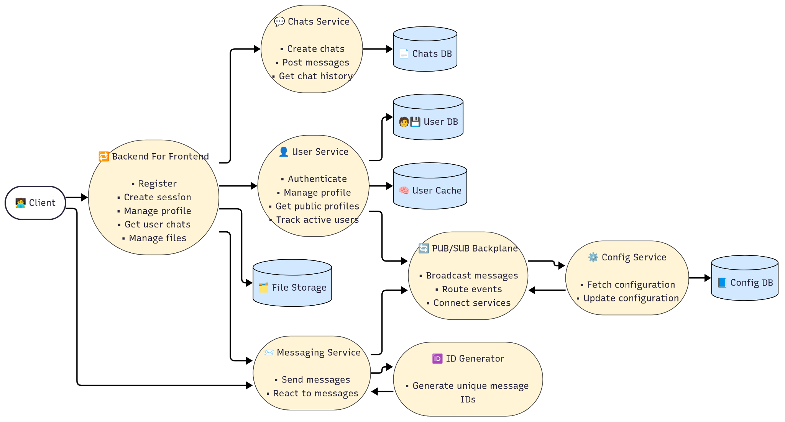
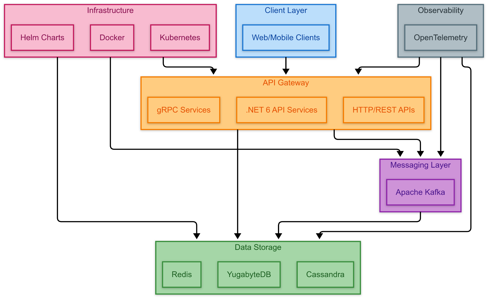

# RealTime Chat App with Kafka and Kubernetes

This project is a highly scalable, cloud-native real-time chat application built using a microservices architecture. It demonstrates key software engineering principles such as asynchronous communication, containerization, orchestration, monitoring, and event-driven messaging.

It is designed for candidates applying to Software Development Engineer (SDE) roles, showcasing practical experience with backend systems, distributed messaging, service orchestration, and system design.

---

## 📐 Architecture Overview

The system adopts a layered, microservices-based architecture. Each service is independently deployable, horizontally scalable, and integrated via asynchronous event streaming.

### System Design Diagram



### Components

- **Client (Web/Mobile)**: Frontend interface where users register, authenticate, and exchange real-time messages.
- **Backend for Frontend (BFF)**: Acts as a secure gateway for clients, orchestrating requests and responses across services.
- **User Service**: Handles authentication, user management, public profile access, and active session tracking.
- **Chat Service**: Manages chat sessions, message posting, and message history.
- **Messaging Service**: Handles real-time message dispatch and reactions via Apache Kafka.
- **ID Generator**: Produces globally unique message identifiers.
- **File Storage**: Stores uploaded files in an S3-compatible object store.
- **Config Service**: Maintains dynamic runtime configurations.
- **Pub/Sub Backplane**: Central communication layer for Kafka event routing between services.
- **Databases**:  
  - Redis for session caching  
  - PostgreSQL/YugabyteDB for transactional data  
  - Cassandra for high-throughput distributed writes

---

## 🛠️ Technology Stack

The application leverages the following technologies to ensure modularity, scalability, and cloud-readiness:

### Tech Stack Diagram



### Infrastructure

- **Docker** – Containerization of services for consistency across environments.
- **Helm Charts** – Parameterized deployments for Kubernetes.
- **Kubernetes** – Container orchestration for high availability and service discovery.

### Backend Services

- **.NET 6** – Strongly typed backend APIs with performance optimizations.
- **gRPC / REST APIs** – Used for service-to-service communication and client-server communication.
- **Apache Kafka** – Event streaming and real-time message delivery.
- **Redis** – Fast in-memory cache and session store.
- **YugabyteDB / PostgreSQL / Cassandra** – Layered data storage to handle both transactional and high-throughput operations.

### Observability

- **OpenTelemetry** – Tracing and metrics collection for monitoring service behavior and debugging.

---

## 🚀 Features

- Real-time chat functionality using Kafka and WebSockets
- Microservices design supporting service independence and horizontal scaling
- Containerized deployment for each component
- Kubernetes-managed orchestration
- Scalable message queues using Apache Kafka
- File upload/download via S3-compatible object storage
- Distributed configuration via dynamic Config Service
- Monitoring and observability with OpenTelemetry
- Compatibility with both SQL and NoSQL databases

---

## 📦 Folder Structure

```
.
├── architecture-diagram.png
├── techstack-diagram.png
├── README.md
├── deploy/                # Kubernetes manifests and Helm charts
├── package/               # Dockerfiles for all services
├── docs/                  # Design and system documentation
├── source/                # Microservices and contracts
│   ├── Messaging.Service/
│   ├── User.Service/
│   ├── Chats.Service/
│   ├── IdGen.Service/
│   ├── Config.Service/
│   ├── Backplane/
│   └── Contracts/
```

---

## 🧪 Testing and Validation

- Unit tests for each service (`*.Testing` modules)
- Load tests for messaging throughput
- Minikube-compatible for local Kubernetes testing
- Integration tests covering Kafka events and API gateways

---

## 🛳️ Deployment

Use the provided Helm charts or raw Kubernetes YAML in the `deploy/` directory. A `build-all-images.sh` script is available in `package/` for local Docker image creation.

---

## 🎯 Use Case

Ideal for real-world demonstration of:

- Asynchronous microservices design
- Message queue integration
- Cloud-native deployment skills
- Practical use of Redis, Kafka, and PostgreSQL
- Infrastructure-as-Code with Kubernetes

---

## 📚 License

This project is licensed under the MIT License.

---

## 🔗 Credits

Adapted and refactored from original base project by [cvetomir-todorov](https://github.com/cvetomir-todorov/CecoChat). Restructured for clarity, modularity, and SDE portfolio alignment.